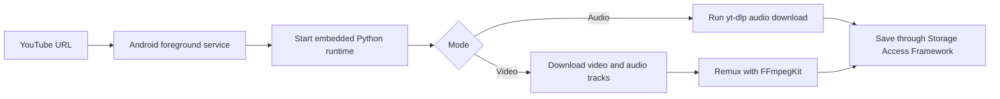
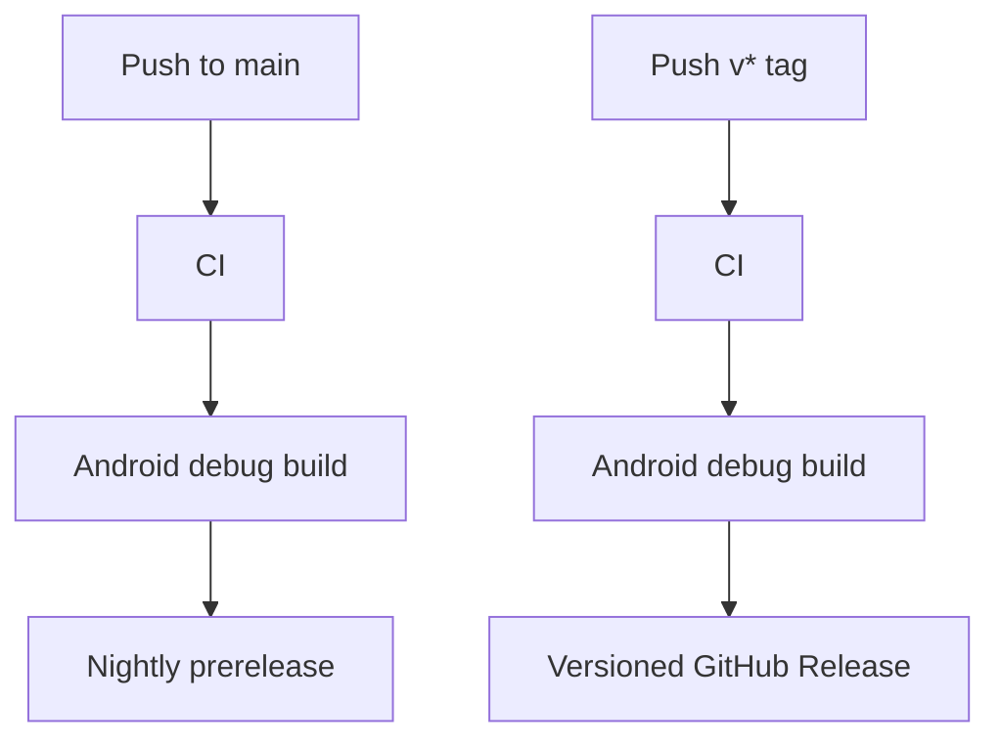

<div align="center">

# YTET Android

YouTube Extractor Toolkit for Android

YouTube URL 하나로 오디오와 영상을 Android 기기에 저장하는 모바일 추출 도구입니다.

[](https://github.com/hojin-v/YTET-Android/actions/workflows/ci.yml)
[](https://github.com/hojin-v/YTET-Android/actions/workflows/release.yml)
[](https://github.com/hojin-v/YTET-Android/releases)


[Download](https://github.com/hojin-v/YTET-Android/releases) · [Features](#features) · [Tech Stack](#tech-stack) · [Caution](#caution)

</div>

## Overview

YTET Android는 YouTube 링크를 오디오 파일이나 영상 파일로 저장합니다.

Android 저장소 권한 모델에 맞춰 사용자가 저장 폴더를 직접 선택하고, 추출 작업은 foreground service에서 진행됩니다. 추출 엔진은 프로젝트 내부의 `YtDlpPythonEngine`이 담당하며, APK에 포함된 Python 런타임과 `yt-dlp` 패키지로 다운로드를 실행합니다.

| Mode | Best For | Output |
| --- | --- | --- |
| Audio | 음악, 강의, 플레이리스트 정리 | `M4A (AAC)`, `Original Opus` |
| Video | 모바일 보관, 고화질 저장 | 최고품질 `MKV` 또는 호환 우선 `MP4` |
| Subtitles | 선택형 한국어/영어 등록 자막 | 가능한 경우 `.srt` 또는 `.vtt` sidecar |

## Features

| Feature | Description |
| --- | --- |
| URL 기반 추출 | YouTube URL을 넣고 저장 폴더를 고르면 추출을 시작합니다. |
| Android 폴더 선택 | Storage Access Framework로 사용자가 지정한 폴더에 결과를 저장합니다. |
| 백그라운드 진행 | foreground service와 알림으로 추출 진행 상태를 표시합니다. |
| 자동 파일명 | 오디오는 `artist - title`, 영상은 `channel - title` 형식으로 저장합니다. |
| 고화질 영상 옵션 | 최고품질은 분리 영상/오디오 트랙을 `MKV`로 병합하고, 1080p/720p/480p는 호환성 좋은 `MP4`를 우선합니다. |
| 선택형 자막 | `자막 포함` 선택 시 등록된 한국어/영어 자막을 sidecar 파일로 저장합니다. |
| 명확한 제한 안내 | 아직 포팅하지 않은 MP3 변환과 자막 삽입은 오류로 안내합니다. |

## Quick Start

1. [Releases](https://github.com/hojin-v/YTET-Android/releases)에서 최신 `YTET-Android-버전-debug.apk` 또는 ZIP을 받습니다.
2. APK를 Android 기기에 설치합니다.
3. YouTube URL을 입력합니다.
4. `음원` 또는 `영상`을 선택합니다.
5. 저장 폴더와 포맷 또는 품질을 고릅니다.
6. 영상일 경우 `자막 포함`을 필요에 맞게 선택합니다.
7. `추출`을 누릅니다.

> 현재 저장소는 `io.github.junkfood02.youtubedl-android` 같은 GPL Android wrapper에 의존하지 않습니다. `yt-dlp`는 Chaquopy 기반 내장 Python 런타임으로 APK에 포함되며, 영상 병합에는 Android NDK 기반 `FFmpegKit`, M4A 커버 태깅에는 `mutagen`, YouTube JS challenge script 패키지에는 `yt-dlp-ejs`를 사용합니다.

## Audio

| Format | When to Use |
| --- | --- |
| `M4A (AAC)` | 기본 추천 포맷 |
| `Original Opus` | YouTube 원본 오디오에 가깝고 용량 효율이 좋은 포맷 |
| `MP3` | FFmpeg 변환 런타임 추가 전까지 Android APK에서 비활성 |

오디오 추출 결과에는 가능한 경우 다음 정보가 포함됩니다.

- 제목
- 아티스트
- 원본 URL
- 커버 이미지
- 가사 또는 자막 기반 텍스트 정보

현재 Android APK는 M4A 결과에 가능한 경우 커버 이미지를 임베딩합니다. MP3 변환과 Original Opus 커버 임베딩은 Android 경로에 아직 포팅하지 않아 비활성입니다.

## Video

| Quality Option | Container | Tags |
| --- | --- | --- |
| 원본 최고품질 | `MKV` | 가능한 최고 video-only 트랙 + 최고 audio-only 트랙 |
| 1080p MP4 | `MP4`, fallback `MKV` | 최대 1080p AVC MP4 트랙 + M4A 오디오 우선 |
| 720p MP4 | `MP4`, fallback `MKV` | 최대 720p AVC MP4 트랙 + M4A 오디오 우선 |
| 480p MP4 | `MP4`, fallback `MKV` | 최대 480p AVC MP4 트랙 + M4A 오디오 우선 |

YouTube의 1080p 이상 영상은 보통 영상/오디오가 분리된 DASH 스트림으로 제공됩니다. Android APK는 이 분리 트랙을 받은 뒤 `FFmpegKit`으로 remux합니다. 최고품질은 Windows 버전처럼 특정 컨테이너에 묶지 않고 가장 좋은 영상 트랙과 오디오 트랙을 고른 뒤 `MKV`로 병합합니다.

기기 기본 플레이어 호환성이 더 중요하면 AVC 트랙을 우선하는 1080p, 720p, 480p MP4 옵션을 권장합니다. `MP4` 조합이 없을 때는 품질을 낮추는 대신 같은 높이 이하의 최고 트랙을 `MKV`로 저장합니다.

## Subtitles & Audio Tracks

영상 모드에서 `자막 포함`을 선택하면 업로더가 등록한 한국어와 영어 자막만 저장합니다.

저장 가능한 자막이 있으면 같은 이름의 `.srt` 또는 `.vtt` 파일을 함께 저장합니다.

자동 생성 자막만 있는 영상은 기본적으로 자막을 저장하지 않습니다.

## Runtime

직접 구현 방식은 Android wrapper 라이브러리 대신 앱 내부 엔진이 `yt-dlp`를 호출합니다.

```text
Java foreground service
    -> Chaquopy Python runtime
    -> yt-dlp Python package
    -> mutagen cover tagging / FFmpegKit native remux
    -> Storage Access Framework copy
```

현재 APK는 `arm64-v8a` ABI를 대상으로 빌드합니다. 선택한 FFmpegKit 배포물이 x86_64 네이티브 라이브러리를 포함하지 않기 때문에 x86_64 에뮬레이터용 APK는 기본 릴리즈 대상에서 제외했습니다.

## Output Rules

```text
audio:    artist - title.ext
video:    channel - title.ext
subtitle: channel - title.ko.srt
subtitle: channel - title.en.srt
```

Android 결과 화면은 저장소로 복사된 파일과 요청 조건만 표시합니다. Windows 앱처럼 화질/코덱/오디오/자막 스트림을 재검증해 표시하는 단계는 아직 포팅하지 않았으며, 확인되지 않은 값은 기본값처럼 표시하지 않습니다.

## How It Works



## Tech Stack

| Layer | Technology | Role |
| --- | --- | --- |
| App | Android SDK, Java | Native mobile UI and foreground service |
| Storage | Storage Access Framework | User-selected output folders |
| Extraction | Chaquopy, `yt-dlp` Python package | Runs downloads inside the APK |
| YouTube Support | `yt-dlp-ejs` scripts | Script package is bundled; Android JS runtime is still pending |
| Tagging | `mutagen` | M4A cover image embedding |
| Media Processing | `FFmpegKit` full package | MKV/MP4 video/audio remuxing with Android NDK libraries |
| Runtime Packaging | Embedded Python package | Avoids GPL Android wrapper dependency |
| Automation | GitHub Actions | CI, Android build, release publishing |

## Build From Source

```bash
./gradlew assembleDebug
```

For CLI builds without Android Studio, set `ANDROID_HOME` or `sdk.dir` so Gradle can find Android SDK Platform 36 and Build Tools 36.0.0.

```bash
scripts/verify_static.sh
./gradlew clean :app:assembleDebug
```

## Release Pipeline



Every release build uploads:

- `YTET-Android-버전-debug.apk`
- `YTET-Android-버전-android-debug.zip`

## Source Environment

공식 소스 빌드 경로는 Android용입니다. GitHub에서 소스 코드를 받은 뒤 Android Studio 또는 Gradle로 APK를 빌드하고, 생성된 APK를 Android 기기에 설치하세요.

릴리즈 파일, CI, 빌드 스크립트는 Android SDK 환경을 기준으로 제공됩니다. Windows/macOS/Linux에서 Gradle 빌드를 실행할 수는 있지만, 앱 실행과 추출 검증은 Android 기기 또는 에뮬레이터가 필요합니다.

```bash
./gradlew :app:assembleDebug
```

CLI 빌드에는 다음 항목이 준비되어 있어야 합니다.

| Item | Role |
| --- | --- |
| JDK 17 | Android Gradle Plugin 실행 |
| Android SDK Platform 36 | 앱 컴파일 대상 SDK |
| Android Build Tools 36.0.0 | APK 패키징 |
| Python 3.12 | Chaquopy `buildPython` 실행 |
| Network access | Gradle, FFmpegKit, Chaquopy와 Python 패키지 다운로드 |

소스 빌드는 ABI별 `yt-dlp` 실행 파일을 `assets/runtime` 아래에 직접 추가하는 방식을 사용하지 않습니다. `yt-dlp`는 `app/build.gradle`의 Chaquopy 설정에 따라 APK 안의 Python 런타임과 함께 패키징됩니다.

YouTube JS challenge 처리를 위한 `yt-dlp-ejs` script package는 포함되어 있지만, Android용 Deno/Node/QuickJS 실행 런타임은 아직 별도로 번들하지 않았습니다. 일부 영상에서 yt-dlp가 JS 런타임 경고를 내며 사용 가능한 format 목록이 제한될 수 있습니다.

## Third-Party Notices

이 저장소의 Android APK는 주요 런타임 의존성을 함께 배포합니다.

| Component | Purpose | License Note |
| --- | --- | --- |
| `yt-dlp` | YouTube metadata and stream download | Unlicense |
| `yt-dlp-ejs` | YouTube JS challenge scripts | Unlicense/MIT/ISC metadata |
| `mutagen` | M4A cover image tagging | GPL-2.0-or-later |
| `FFmpegKit full` / FFmpeg libraries | MKV/MP4 remuxing | LGPL-3.0 package metadata; FFmpeg library notices apply |
| Chaquopy Python runtime | Embedded Python on Android | Chaquopy and bundled Python runtime notices apply |

개인용으로 쓰더라도 GitHub Release에 APK를 올리면 배포에 해당하므로, 의존성 고지와 소스 공개 상태를 유지하는 편이 좋습니다.

## Caution

- 권한이 있는 콘텐츠에만 사용하세요.
- YouTube 서비스 약관과 지역 법규를 확인해야 합니다.
- 영상 제공 품질과 자막 여부는 YouTube와 업로더 설정에 따라 달라집니다.
- MP3 변환과 자막 삽입은 Android 경로에 아직 포팅하지 않았습니다.
- 내장 Python, `yt-dlp`, `mutagen`, `FFmpegKit` 등 함께 배포되는 런타임의 라이선스와 고지 의무를 확인해야 합니다.
- 처음 설치하는 APK는 Android 보안 경고가 표시될 수 있습니다. 신뢰할 수 있는 출처에서 받은 파일인지 확인한 뒤 설치하세요.
