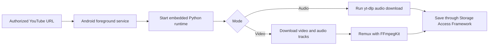
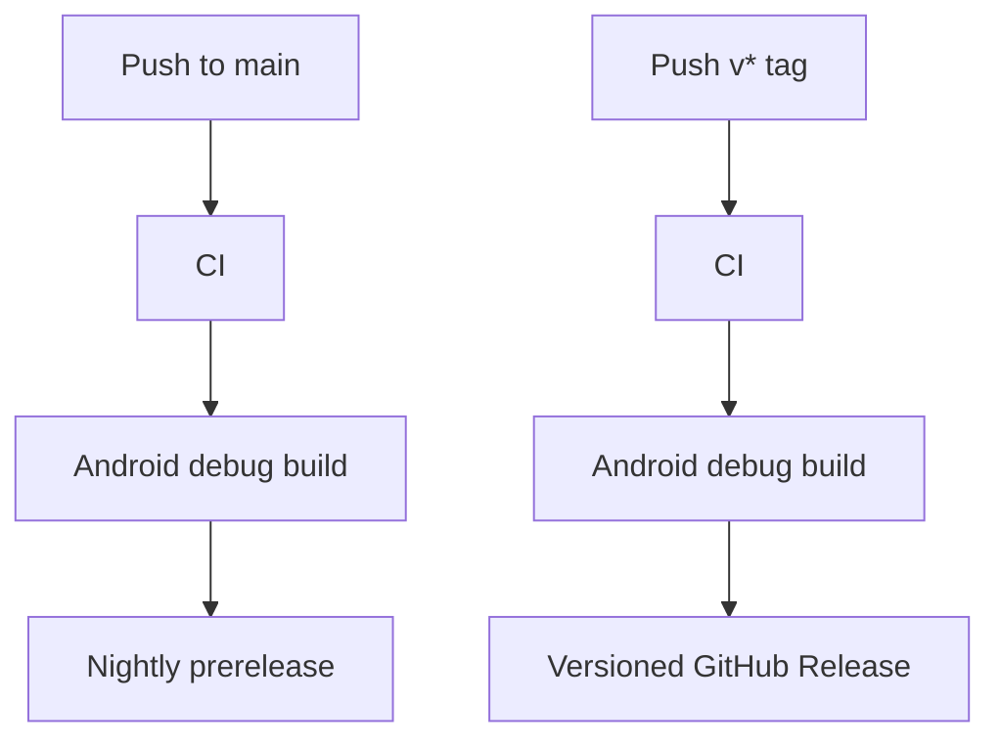

<div align="center">

# YTET

YouTube Extractor Toolkit

Android 저장소에서 개발되는 YTET 모바일 앱입니다. 앱 표시 이름은 `YTET`이며, 로컬 음악 스트리밍, 디바이스 음악 관리, YouTube 추출기를 하단 탭으로 제공합니다.

[](https://github.com/hojin-v/YTET-Android/actions/workflows/ci.yml)
[](https://github.com/hojin-v/YTET-Android/actions/workflows/release.yml)
[](https://github.com/hojin-v/YTET-Android/releases)


[Download](https://github.com/hojin-v/YTET-Android/releases) · [Features](#features) · [Streaming](#streaming) · [Library](#library) · [Extractor](#extractor) · [Caution](#caution)

</div>

## Overview

YTET는 기존 YouTube 추출기 기능을 유지하면서, 기기에 저장된 음악을 앱 안에서 빠르게 듣고 관리하는 Android 앱입니다.

하단 탭은 `홈`, `내 음악`, `추출기`로 구성됩니다. 홈은 Android MediaStore에서 읽은 로컬 음악만으로 전체 셔플, 아티스트 믹스, 폴더 믹스를 만들고, 내 음악은 폴더와 파일을 스캔해 재생/공유/삭제를 제공합니다. 추출 작업은 기존처럼 사용자가 저장 폴더를 직접 선택하고 foreground service에서 진행됩니다.

| Tab | Best For | Main Actions |
| --- | --- | --- |
| Home | 로컬 추천 믹스와 스트리밍 | 전체 셔플, 아티스트 믹스, 폴더 믹스 |
| Library | 디바이스 음악 폴더/파일 관리 | 폴더 필터, 앱 내 재생, 파일 열기, 공유, 삭제 |
| Extractor | 권한이 있는 YouTube 링크 저장 | `M4A`, Original Opus, `MP4`/`MKV`, 자막 |

## Features

| Feature | Description |
| --- | --- |
| 홈 추천 믹스 | Spotify식 하단 플레이어와 카드형 추천 목록으로 실제 보유 음악 기반 믹스를 재생합니다. |
| 로컬 스트리밍 재생 | MediaStore content URI로 기기 내 음악을 앱 안에서 재생합니다. |
| 백그라운드 플레이어 | 화면을 잠그거나 앱을 나가도 foreground media playback service가 재생을 유지하고 알림/잠금화면 컨트롤을 제공합니다. |
| 검증 가능한 분류 | 무드나 장르를 추측하지 않고 실제 아티스트 메타데이터와 폴더명 기준으로 믹스를 만듭니다. |
| 디바이스 음악 관리 | `READ_MEDIA_AUDIO` 또는 `READ_EXTERNAL_STORAGE` 권한으로 MediaStore 음악을 폴더별로 정리합니다. |
| 파일 액션 | 선택한 음악 파일을 앱 안에서 재생하거나 열기, 공유, Android 삭제 확인 플로우로 관리합니다. |
| URL 기반 추출 | 권한이 있는 YouTube URL을 넣고 저장 폴더를 고르면 추출을 시작합니다. |
| Android 폴더 선택 | Storage Access Framework로 사용자가 지정한 폴더에 결과를 저장합니다. |
| 백그라운드 진행 | foreground service와 알림으로 추출 진행 상태를 표시합니다. |
| 자동 파일명 | 오디오는 `artist - title`, 영상은 `channel - title` 형식으로 저장합니다. |
| 고화질 영상 옵션 | 최고품질은 분리 영상/오디오 트랙을 `MKV`로 병합하고, 1080p/720p/480p는 호환성 좋은 `MP4`를 우선합니다. |
| 선택형 자막 | `자막 포함` 선택 시 등록된 한국어/영어 자막을 영상 파일 안에 트랙으로 삽입합니다. |
| 명확한 제한 안내 | 아직 포팅하지 않은 MP3 변환은 오류로 안내합니다. |

## Quick Start

1. [Releases](https://github.com/hojin-v/YTET-Android/releases)에서 최신 `YTET-Android-버전-debug.apk` 또는 ZIP을 받습니다.
2. APK를 Android 기기에 설치합니다.
3. `홈`에서 오디오 권한을 허용한 뒤 기기 음악 기반 추천 믹스를 재생합니다.
4. `내 음악`에서 기기 음악을 폴더별로 보고 선택한 파일을 앱 안에서 재생합니다.
5. `추출기`에서 권한이 있는 YouTube URL을 입력합니다.
6. `음원` 또는 `영상`, 저장 폴더, 포맷 또는 품질을 고릅니다.
7. 영상일 경우 `자막 포함`을 필요에 맞게 선택한 뒤 `추출`을 누릅니다.

> 현재 저장소는 `io.github.junkfood02.youtubedl-android` 같은 GPL Android wrapper에 의존하지 않습니다. `yt-dlp`는 Chaquopy 기반 내장 Python 런타임으로 APK에 포함되며, 영상 병합에는 Android NDK 기반 `FFmpegKit`, M4A 커버 태깅에는 `mutagen`, YouTube JS challenge script 패키지에는 `yt-dlp-ejs`를 사용합니다.

## Streaming

홈 탭은 추천 믹스와 하단 미니 플레이어를 중심으로 구성됩니다. 여기서 스트리밍은 외부 라디오나 네트워크 URL을 가져오는 기능이 아니라, 디바이스에 저장된 음악 파일을 앱 내부 플레이어로 이어서 재생하는 로컬 스트리밍을 뜻합니다.

추천 목록은 세 가지 흐름으로 나뉩니다.

- 전체 셔플: 디바이스에 저장된 모든 음악을 섞어 재생
- 아티스트 믹스: MediaStore의 아티스트 값이 정확히 같은 곡만 묶은 셔플
- 폴더 믹스: 디바이스 폴더명이 같은 곡만 묶은 셔플

YTET는 사용자가 보유하지 않은 음악 취향을 추측해 “밤에 어울리는 음악”, “차분한 힙합” 같은 테마를 만들지 않습니다. 그런 분류는 오분류를 만들 수 있으므로, 앱은 실제 파일 메타데이터와 폴더 구조에서 확인되는 값만 사용합니다.

재생은 `PlaybackService`에서 foreground media playback으로 유지됩니다. 앱을 나가거나 화면을 잠근 뒤에도 재생이 이어지며, Android 알림 영역과 잠금화면에서 이전, 재생/일시정지, 다음 컨트롤을 사용할 수 있습니다.

## Library

내 음악 탭은 Android MediaStore를 사용합니다.

| Android Version | Permission |
| --- | --- |
| Android 13+ | `READ_MEDIA_AUDIO` |
| Android 12L and below | `READ_EXTERNAL_STORAGE` |

스캔된 음악은 폴더 칩과 파일 목록으로 표시됩니다. 파일을 선택하면 앱 내 재생, 열기, 공유, 삭제 작업을 실행할 수 있으며, Android 11 이상에서는 시스템 삭제 확인 화면을 거칩니다.

## Extractor

추출기 탭은 기존 YouTube 저장 기능을 유지합니다.

## Audio

| Format | When to Use |
| --- | --- |
| `M4A (AAC)` | 기본 추천 포맷 |
| `Original Opus` | 제공되는 원본 오디오 스트림에 가깝고 용량 효율이 좋은 포맷 |
| `MP3` | FFmpeg 변환 런타임 추가 전까지 Android APK에서 비활성 |

오디오 추출 결과에는 가능한 경우 다음 정보가 포함됩니다.

- 제목
- 아티스트
- 원본 URL
- 커버 이미지
- 가사 또는 자막 기반 텍스트 정보

현재 Android APK는 M4A 결과에 가능한 경우 커버 이미지를 임베딩합니다. MP3 변환과 Original Opus 커버 임베딩은 Android 경로에 아직 포팅하지 않아 비활성입니다.

## Video

| Quality Option | Container | Tags |
| --- | --- | --- |
| 원본 최고품질 | `MKV` | 가능한 최고 video-only 트랙 + 최고 audio-only 트랙 |
| 1080p MP4 | `MP4`, fallback `MKV` | 최대 1080p AVC MP4 트랙 + M4A 오디오 우선 |
| 720p MP4 | `MP4`, fallback `MKV` | 최대 720p AVC MP4 트랙 + M4A 오디오 우선 |
| 480p MP4 | `MP4`, fallback `MKV` | 최대 480p AVC MP4 트랙 + M4A 오디오 우선 |

YouTube의 1080p 이상 영상은 보통 영상/오디오가 분리된 DASH 스트림으로 제공됩니다. Android APK는 이 분리 트랙을 받은 뒤 `FFmpegKit`으로 remux합니다. 최고품질은 Windows 버전처럼 특정 컨테이너에 묶지 않고 가장 좋은 영상 트랙과 오디오 트랙을 고른 뒤 `MKV`로 병합합니다.

기기 기본 플레이어 호환성이 더 중요하면 AVC 트랙을 우선하는 1080p, 720p, 480p MP4 옵션을 권장합니다. `MP4` 조합이 없을 때는 품질을 낮추는 대신 같은 높이 이하의 최고 트랙을 `MKV`로 저장합니다.

## Subtitles

영상 모드에서 `자막 포함`을 선택하면 업로더가 등록한 한국어와 영어 자막만 가져옵니다.

저장 가능한 자막이 있으면 FFmpegKit remux 단계에서 영상 파일 안의 자막 트랙으로 삽입합니다. MP4 결과에는 `mov_text`, MKV 결과에는 SRT 자막 트랙을 사용합니다.

자동 생성 자막만 있는 영상은 기본적으로 자막을 저장하지 않습니다.

## Runtime

직접 구현 방식은 Android wrapper 라이브러리 대신 앱 내부 엔진이 `yt-dlp`를 호출합니다.

```text
Java foreground service
    -> Chaquopy Python runtime
    -> yt-dlp Python package
    -> mutagen cover tagging / FFmpegKit native remux
    -> Storage Access Framework copy
```

현재 APK는 `arm64-v8a` ABI를 대상으로 빌드합니다. 선택한 FFmpegKit 배포물이 x86_64 네이티브 라이브러리를 포함하지 않기 때문에 x86_64 에뮬레이터용 APK는 기본 릴리즈 대상에서 제외했습니다.

## Output Rules

```text
audio:    artist - title.ext
video:    channel - title.ext
subtitle: embedded in video when requested
```

Android 결과 화면은 저장소로 복사된 파일과 요청 조건만 표시합니다. Windows 앱처럼 화질/코덱/오디오/자막 스트림을 재검증해 표시하는 단계는 아직 포팅하지 않았으며, 확인되지 않은 값은 기본값처럼 표시하지 않습니다.

## How It Works



## Tech Stack

| Layer | Technology | Role |
| --- | --- | --- |
| App | Android SDK, Java | Native mobile UI and foreground service |
| Storage | Storage Access Framework | User-selected output folders |
| Extraction | Chaquopy, `yt-dlp` Python package | Runs downloads inside the APK |
| YouTube Support | `yt-dlp-ejs` scripts | Script package is bundled; Android JS runtime is still pending |
| Tagging | `mutagen` | M4A cover image embedding |
| Media Processing | `FFmpegKit` full package | MKV/MP4 video/audio remuxing with Android NDK libraries |
| Runtime Packaging | Embedded Python package | Avoids GPL Android wrapper dependency |
| Automation | GitHub Actions | CI, Android build, release publishing |

## Build From Source

```bash
./gradlew assembleDebug
```

For CLI builds without Android Studio, set `ANDROID_HOME` or `sdk.dir` so Gradle can find Android SDK Platform 36 and Build Tools 36.0.0.

```bash
scripts/verify_static.sh
./gradlew clean :app:assembleDebug
```

## Release Pipeline



Every release build uploads:

- `YTET-Android-버전-debug.apk`
- `YTET-Android-버전-android-debug.zip`

## Source Environment

공식 소스 빌드 경로는 Android용입니다. GitHub에서 소스 코드를 받은 뒤 Android Studio 또는 Gradle로 APK를 빌드하고, 생성된 APK를 Android 기기에 설치하세요.

릴리즈 파일, CI, 빌드 스크립트는 Android SDK 환경을 기준으로 제공됩니다. Windows/macOS/Linux에서 Gradle 빌드를 실행할 수는 있지만, 앱 실행과 추출 검증은 Android 기기 또는 에뮬레이터가 필요합니다.

```bash
./gradlew :app:assembleDebug
```

CLI 빌드에는 다음 항목이 준비되어 있어야 합니다.

| Item | Role |
| --- | --- |
| JDK 17 | Android Gradle Plugin 실행 |
| Android SDK Platform 36 | 앱 컴파일 대상 SDK |
| Android Build Tools 36.0.0 | APK 패키징 |
| Python 3.12 | Chaquopy `buildPython` 실행 |
| Network access | Gradle, FFmpegKit, Chaquopy와 Python 패키지 다운로드 |

소스 빌드는 ABI별 `yt-dlp` 실행 파일을 `assets/runtime` 아래에 직접 추가하는 방식을 사용하지 않습니다. `yt-dlp`는 `app/build.gradle`의 Chaquopy 설정에 따라 APK 안의 Python 런타임과 함께 패키징됩니다.

YouTube JS challenge 처리를 위한 `yt-dlp-ejs` script package는 포함되어 있지만, Android용 Deno/Node/QuickJS 실행 런타임은 아직 별도로 번들하지 않았습니다. 일부 영상에서 yt-dlp가 JS 런타임 경고를 내며 사용 가능한 format 목록이 제한될 수 있습니다.

## Third-Party Notices

이 저장소의 Android APK는 주요 런타임 의존성을 함께 배포합니다.

| Component | Purpose | License Note |
| --- | --- | --- |
| `yt-dlp` | YouTube metadata and stream download | Unlicense |
| `yt-dlp-ejs` | YouTube JS challenge scripts | Unlicense/MIT/ISC metadata |
| `mutagen` | M4A cover image tagging | GPL-2.0-or-later |
| `FFmpegKit full` / FFmpeg libraries | MKV/MP4 remuxing | LGPL-3.0 package metadata; FFmpeg library notices apply |
| Chaquopy Python runtime | Embedded Python on Android | Chaquopy and bundled Python runtime notices apply |

개인용으로 쓰더라도 GitHub Release에 APK를 올리면 배포에 해당하므로, 의존성 고지와 소스 공개 상태를 유지하는 편이 좋습니다.

## Caution

- 권한이 있는 콘텐츠에만 사용하세요.
- YouTube 서비스 약관과 지역 법규를 확인해야 합니다.
- YTET는 YouTube 또는 Google과 관련이 없습니다.
- 영상 제공 품질과 자막 여부는 YouTube와 업로더 설정에 따라 달라집니다.
- MP3 변환은 Android 경로에 아직 포팅하지 않았습니다.
- 내장 Python, `yt-dlp`, `mutagen`, `FFmpegKit` 등 함께 배포되는 런타임의 라이선스와 고지 의무를 확인해야 합니다.
- 처음 설치하는 APK는 Android 보안 경고가 표시될 수 있습니다. 신뢰할 수 있는 출처에서 받은 파일인지 확인한 뒤 설치하세요.
