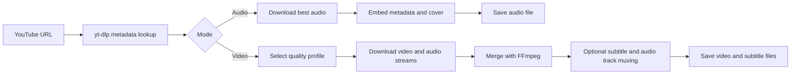
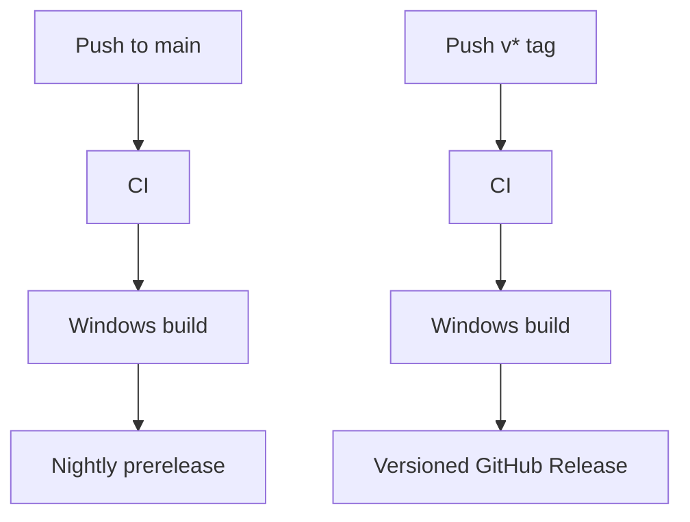

<div align="center">

# YTET

YouTube Extractor Toolkit

YouTube URL 하나로 오디오와 영상을 저장하는 Windows용 데스크톱 추출 도구입니다.

[](https://github.com/hojin-v/YTET/actions/workflows/ci.yml)
[](https://github.com/hojin-v/YTET/actions/workflows/release.yml)
[](https://github.com/hojin-v/YTET/releases)


[Download](https://github.com/hojin-v/YTET/releases) · [Features](#features) · [Tech Stack](#tech-stack) · [Caution](#caution)

</div>

## Overview

YTET는 YouTube 링크를 오디오 파일이나 영상 파일로 저장합니다.

오디오는 커버 이미지와 제목, 아티스트, 원본 URL 같은 메타데이터를 파일 안에 포함합니다. 영상은 기본적으로 YouTube가 제공하는 최고 품질을 선택하고, 필요하면 1080p, 720p, 480p 이하의 낮은 용량 옵션으로 저장할 수 있습니다. 자막과 다중 오디오는 영상 추출 전에 선택합니다.

| Mode | Best For | Output |
| --- | --- | --- |
| Audio | 음악, 강의, 플레이리스트 정리 | `M4A (AAC)`, `Original Opus`, `MP3` |
| Video | 롱폼, 숏폼, 고화질 보관 | 최고 품질 `MKV` 또는 호환 우선 `MP4` |
| Subtitles | 선택형 한국어/영어 등록 자막 | 영상 내 자막 트랙 + `.srt` |
| Multi Audio | 선택형 다국어 오디오 | 원본 오디오 + 한국어 오디오 트랙 |

## Features

| Feature | Description |
| --- | --- |
| URL 기반 추출 | YouTube URL을 넣고 저장 폴더를 고르면 추출을 시작합니다. |
| 오디오 메타데이터 | 제목, 아티스트, 원본 URL, 커버 이미지를 가능한 범위에서 파일에 기록합니다. |
| 자동 파일명 | 오디오는 `artist - title`, 영상은 `channel - title` 형식으로 저장합니다. |
| 4K/8K 지원 | 최고 품질 모드에서 YouTube가 제공하는 고해상도 스트림을 선택합니다. |
| 저용량 영상 옵션 | 1080p, 720p, 480p 이하 품질로 저장할 수 있습니다. |
| 선택형 자막 | `자막 포함` 선택 시 등록된 한국어/영어 자막을 저장하고 영상에도 삽입합니다. |
| 선택형 다중 오디오 | `다중 오디오 포함` 선택 시 원본/한국어 오디오 트랙을 함께 보관합니다. |

## Quick Start

1. [Releases](https://github.com/hojin-v/YTET/releases)에서 최신 `YTET.exe` 또는 `YTET-버전-windows-x64.zip`을 받습니다.
2. `YTET.exe`를 실행합니다.
3. YouTube URL을 입력합니다.
4. `음원` 또는 `영상`을 선택합니다.
5. 저장 폴더와 포맷 또는 품질을 고릅니다.
6. 영상일 경우 `자막 포함`, `다중 오디오 포함`을 필요에 맞게 선택합니다.
7. `추출`을 누릅니다.

## Audio

| Format | When to Use |
| --- | --- |
| `M4A (AAC)` | 기본 추천 포맷 |
| `Original Opus` | YouTube 원본 오디오에 가깝고 용량 효율이 좋은 포맷 |
| `MP3` | 오래된 기기나 앱과의 호환성이 필요한 경우 |

오디오 추출 결과에는 가능한 경우 다음 정보가 포함됩니다.

- 제목
- 아티스트
- 원본 URL
- 커버 이미지
- 가사 또는 자막 기반 텍스트 정보

오디오 추출 시 별도의 커버 이미지 파일이나 메타데이터 파일은 남기지 않습니다.

## Video

| Quality Option | Container | Tags |
| --- | --- | --- |
| 원본 최고품질 | `MKV` | 4K/8K, AV1/VP9, Opus, 파일 용량 큼 |
| 1080p MP4 | `MP4` | 호환 우선, H.264/AAC, 최대 1080p |
| 720p MP4 | `MP4` | 저용량, 모바일 보관, 작은 글자 약함 |
| 480p MP4 | `MP4` | 최소용량, 확인용, 큰 화면 약함 |

YouTube의 4K 이상 영상은 보통 H.264 MP4가 아니라 VP9 또는 AV1 같은 고효율 코덱으로 제공됩니다. 그래서 최고 품질 결과는 `.mkv`가 될 수 있습니다.

호환성이 더 중요하면 1080p 이하 MP4 옵션을 권장합니다.

추출이 끝나면 앱의 결과 영역에서 최종 형식, 실제 화질/코덱, 저장 용량을 확인할 수 있습니다.

```text
형식: MKV (.mkv)
화질/코덱: 3840x2160, 30fps, av1
용량: 18.9 MB
```

## Subtitles & Audio Tracks

영상 모드에서 `자막 포함`을 선택하면 업로더가 등록한 한국어와 영어 자막만 저장합니다.

저장 가능한 자막이 있으면 영상 파일 안에 자막 트랙을 넣고, 플레이어 호환을 위해 같은 이름의 `.srt` 파일도 함께 저장합니다.

자동 생성 자막만 있는 영상은 기본적으로 자막을 저장하지 않습니다.

영상 모드에서 `다중 오디오 포함`을 선택하면 여러 오디오 언어가 제공되는 영상의 원본 오디오를 유지합니다. 원본 오디오가 한국어가 아니고 YouTube가 한국어 오디오 트랙을 제공하면, 한국어 오디오도 함께 추가합니다.

컨테이너별 차이는 다음과 같습니다.

| Container | Tags |
| --- | --- |
| `MKV` | 원본 품질, AV1/VP9/Opus, 자막/다중 오디오 |
| `MP4` | 호환 우선, H.264/AAC, Android/Windows 기본 환경 |

## Output Rules

```text
audio:    artist - title.ext
video:    channel - title.ext
subtitle: channel - title.ko.srt
subtitle: channel - title.en.srt
```

## How It Works



## Tech Stack

| Layer | Technology | Role |
| --- | --- | --- |
| App | Python, Tkinter | Lightweight Windows desktop UI |
| Extraction | yt-dlp | YouTube metadata, stream selection, download orchestration |
| YouTube Support | yt-dlp-ejs, bundled Deno runtime | YouTube JS challenge handling for full stream access |
| Media Processing | FFmpeg via imageio-ffmpeg | Audio conversion, video merge, subtitle/audio track muxing |
| Tagging | mutagen | Audio metadata and cover image embedding |
| Packaging | PyInstaller | Single-file Windows executable build |
| Automation | GitHub Actions | CI, Windows build, release publishing |

## Release Pipeline



Every release build uploads:

- `YTET.exe`
- `YTET-버전-windows-x64.zip`

## Caution

- 권한이 있는 콘텐츠에만 사용하세요.
- YouTube 서비스 약관과 지역 법규를 확인해야 합니다.
- 영상 제공 품질, 자막, 다중 오디오 여부는 YouTube와 업로더 설정에 따라 달라집니다.
- 4K 이상 영상은 파일 크기가 클 수 있고, 일부 플레이어에서 코덱 지원이 필요할 수 있습니다.
- 처음 내려받은 실행 파일은 Windows 보안 경고가 표시될 수 있습니다. 신뢰할 수 있는 출처에서 받은 파일인지 확인한 뒤 실행하세요.
